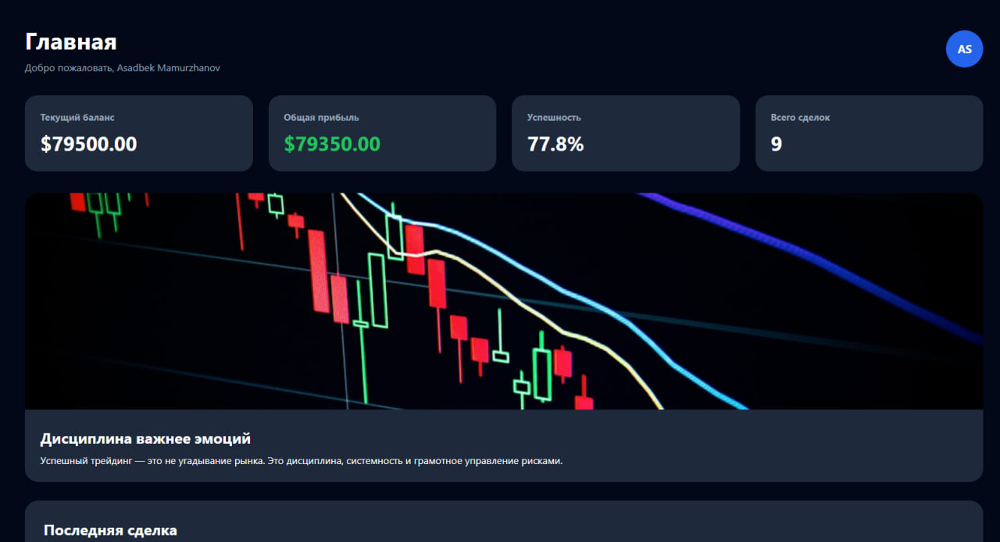
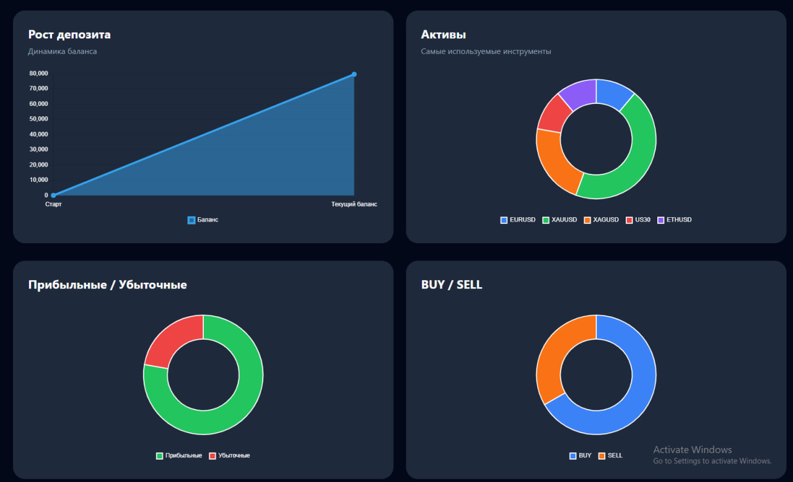
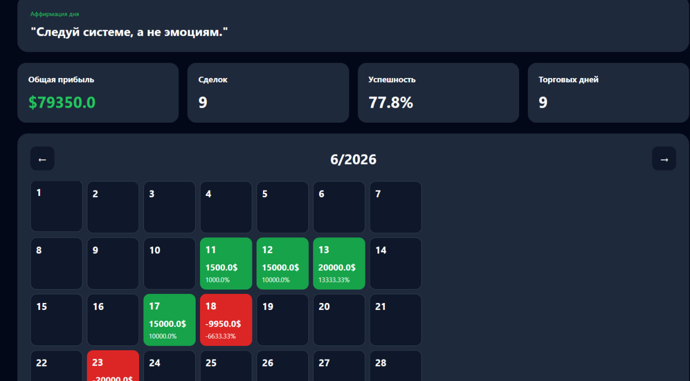

# Trading Journal SaaS

Trading Journal is a web application built with Django.

## Features

- User Authentication
- Trade Management
- Trading Statistics
- Trading Calendar
- Task Management
- User Profiles
- Export Reports
- Responsive Design

## Tech Stack

- Python
- Django
- PostgreSQL
- HTML
- CSS
- JavaScript
- Bootstrap

## Author

Assadulloh

## Screenshots

### Dashboard

### Statistics

### Calendar

